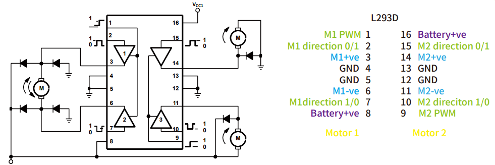
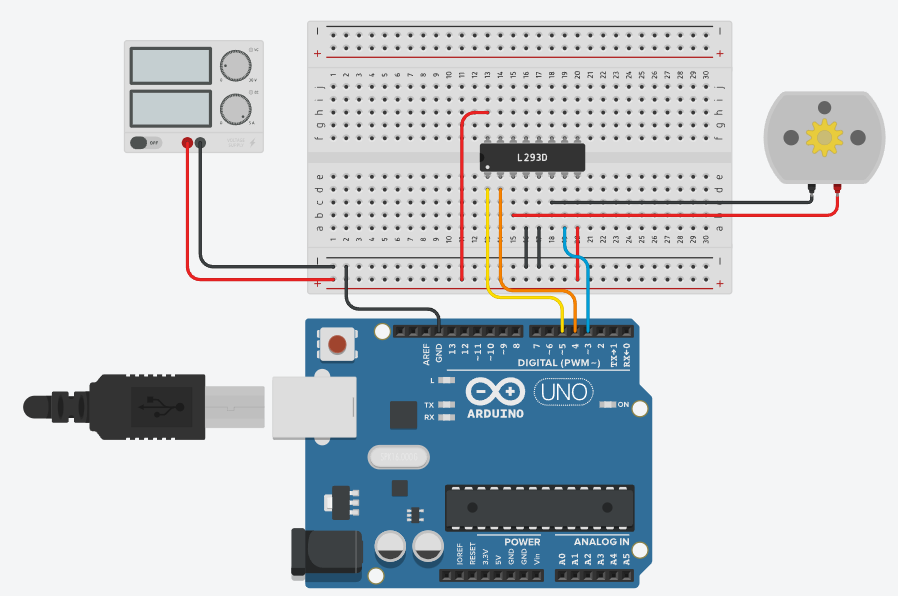

# Example: L293D + DC Motor

The L293 and L293D are quadruple **high-current half-H drivers**. The **L293** is designed to provide 
bidirectional drive currents of up to 1 A at voltages from 4.5 V to 36 V. The **L293D** is designed to provide 
bidirectional drive currents of up to 600-mA at voltages from 4.5 V to 36 V. 
Both devices are designed to drive inductive loads such as relays, solenoids, dc and bipolar stepping motors, 
as well as other high-current/high-voltage loads in positive-supply applications.

**All inputs are TTL compatible**. Each output is a complete totem-pole drive circuit, with a Darlington 
transistor sink and a pseudo-Darlington source. Drivers are enabled in pairs, with drivers 1 and 2 
enabled by `1,2EN` and drivers 3 and 4 enabled by `3,4EN`. When an enable input is high, the associated 
drivers are enabled, and their outputs are active and in phase with their inputs. When the enable input 
is low, those drivers are disabled, and their outputs are off and in the high-impedance state. 



With the proper data inputs, each pair of drivers forms a **full-H (or bridge)** reversible drive suitable for solenoid 
or motor applications.


## Wiring Diagram 

Connect the L293D pin 1 (M1 PWM) to the digital (PWM) pin 5 on the Arduino.  
Output any integer between 0 and 255, where 0 will be off, 128 is half speed and 255 is max speed.

L293D pin 2 (M1 direction 0/1) and L293D pin 7 (M1 direction 1/0) to the digital Arduino pins 4 and 3. 
Output one pin as HIGH and the other pin as LOW, and the motor will spin in one direction.
Reverse the outputs to LOW and HIGH, and the motor will spin in the other direction



Note that the **DC motor needs its own power supply** (more current and sometimes higher voltage).
In this case, the two **GND potentials must be connected** to each other (see circuit).


## Source Code

No library is required for this example, since all signals can be output directly via the Arduino pins.

```C
const int ENABLE = 5;
const int DIR_A = 3;
const int DIR_B = 4;

void setup() 
{
    pinMode(ENABLE,OUTPUT);
    pinMode(DIR_A,OUTPUT);
    pinMode(DIR_B,OUTPUT);
}

void loop() 
{
    digitalWrite(ENABLE,HIGH);  
    digitalWrite(DIR_A,HIGH);    
    digitalWrite(DIR_B,LOW);
    delay(1000);

    digitalWrite(ENABLE,LOW); 
    delay(1000);    

    digitalWrite(ENABLE,HIGH); 
    digitalWrite(DIR_A,LOW); 
    digitalWrite(DIR_B,HIGH);
    delay(1000);

    digitalWrite(ENABLE,LOW); 
    delay(1000);    
}
```
Note that we need a **delay between the commands** to give the DC motor some time to move to follow.


## Simulation

**Tinkercad**: [Arduino: L293D + DC Motor](https://www.tinkercad.com/things/cquv6WcyB61) 


## References
* [YouTube (Paul McWhorter): Arduino Tutorial 37: Understanding How to Control DC Motors in Projects](https://youtu.be/fPLEncYrl4Q)
* [YouTube (DroneBot Workshop): Controlling DC Motors with the L298N H Bridge and Arduino](https://youtu.be/dyjo_ggEtVU)
* [YouTube: Arduino for Beginners 20 Using a Motor Shield](https://youtu.be/cqfkH7pyyfY)


*Egon Teiniker, 2020 - 2022, GPL v3.0*
