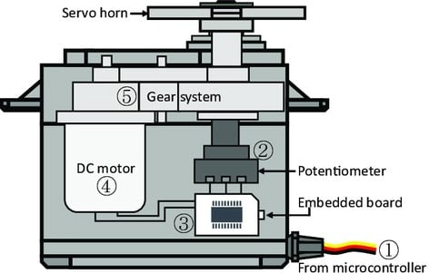
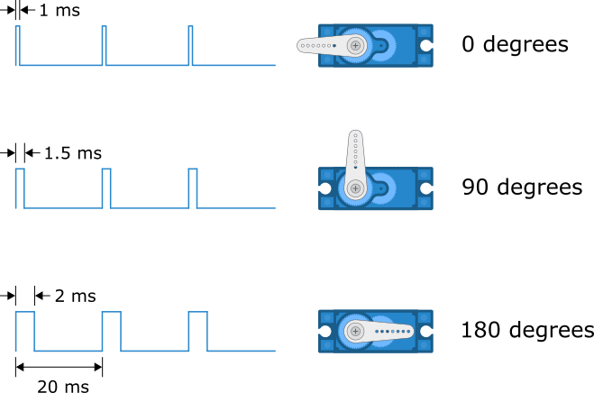

# Example: Servo Motor SG90

Servo is a type of geared motor that can only **rotate 180 degrees**. 

A standard hobby servo typically consists of a **small electric motor, a potentiometer, control electronics, and a gearbox**. 
The position of the output shaft is constantly measured by the internal potentiometer and compared with the target position 
set by the controller (e.g. the Arduino).



According to the error, the control electronics adjust the actual position of the output shaft so that it matches the 
target position. This is known as a closed-loop control system.

Servo motors are controlled by sending a **PWM (pulse-width modulation) signal to the signal line of the servo**. 

The width of the pulses determines the position of the output shaft:
* When we send the servo a signal with a pulse width of **1.5 milliseconds (ms)**, 
    the servo will move to the **neutral position (90 degrees)**. 
* The min **(0 degrees) and max (180 degrees)** position typically correspond to a pulse width of **1 ms and 2 ms** respectively. 



Note this can vary slightly between different types and brands of servo motors (e.g. 0.5 and 2.5 ms). Many servos only rotate through about 170 degrees (or even only 90) but the middle position is almost always at 1.5 ms.

Servo motors generally expect a pulse every **20 milliseconds or 50 Hz** but many RC servos work fine in a range of 40 to 200 Hz.

## Wiring Diagram 

The Servo has three wires, of which the **brown** one is the **ground wire** and should be connected to the 
GND port of UNO, the **red** one is the **power wire** and should be connected to the 5V port, and the 
**orange** one is the **signal wire** and should be connected to the digital pin 3 (use a PWM pin).


## Source Code

To control the servo motor we will be using the `Servo.h` library which comes **pre-installed** with the Arduino IDE.

```C
#include <Servo.h>

const int SERVO_PWM_PIN = 3;

Servo myservo;

void setup(void)
{
    myservo.attach(SERVO_PWM_PIN); 
} 

void loop(void)
{
    myservo.write(90);  // 90°
    delay(1000);

    myservo.write(0);   // 0°
    delay(1000);

    myservo.write(90);  // 90°
    delay(1000);

    myservo.write(180); // 180°
    delay(1000);
}
```
In the **setup()** section of the code, we `attach()` the servo object that we created to the pin that will control the servo. 

In the first part of the **loop()** function, we simply tell the servo motor to move to a particular angle with the 
function `write()`. 
Note that we need a delay between the commands to give the servo motor some time to move to the set position.

**Simulation (Tinkercad)**: [Arduino: Motor Servo](https://www.tinkercad.com/things/0q3C1mj7NeS) 


## Library Operations

A servo is activated by creating an instance of the `Servo` class passing the desired pin to the `attach()` method.
The servos are pulsed in the background using the value most recently written using the `write()` method.

*  **uint8_t attach(int pin)**\
    Attaches a servo motor to an I/O pin which provides PWM (attach the given pin to the next free channel, sets pinMode)
    Returns channel number or INVALID_SERVO if failure.

* **uint8_t attach(int pin, int min, int max)**\
    Attaches to a pin setting min and max values in microseconds default min is 544, max is 2400. 

*  **void write(int value)**\
    Sets the servo angle in degrees (if value is < 200 its treated as an angle, otherwise as pulse width in microseconds).

* **void writeMicroseconds(int value)**\
    Sets the servo pulse width in microseconds. 

* **int read()**\
    Gets the last written servo pulse width as an angle between 0 and 180 degrees. 

* **int readMicroseconds()**\
    Gets the last written servo pulse width in microseconds. 

* **bool attached()**\
    Returns true if there is a servo attached, otherwise false. 

* **void detach()**\
    Stops an attached servos from pulsing its I/O pin. 

Note that `analogWrite()` of PWM on pins associated with the timer are disabled when the first servo is attached.


## References
* [YouTube (Paul McWhorter): Arduino Tutorial 30: Understanding and Using Servos in Projects](https://youtu.be/aFHu65LiFok)
* [YouTube (DroneBot Workshop): Using Servo Motors with Arduino](https://youtu.be/kUHmYKWwuWs)
* [How to control servo motors with Arduino](https://www.makerguides.com/servo-arduino-tutorial/)

* [GitHub: Servo Library for Arduino](https://github.com/arduino-libraries/Servo)


*Egon Teiniker, 2020 - 2022, GPL v3.0*
