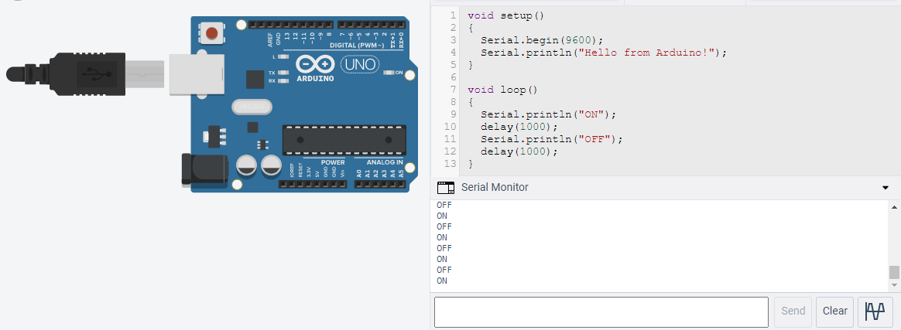

# Serial

Serial is used for communication between the Arduino board and a computer or other devices. 
All Arduino boards have at least one serial port (also known as a UART or USART). 

It communicates on **digital pins 0 (RX)** and **1 (TX)** as well as with the computer via **USB**. 
Thus, if you use these functions, you cannot also use pins 0 and 1 for digital input or output.

We can use the Arduino environment's built-in **serial monitor** to communicate with an Arduino board. 
In the monitor, we select the same baud rate used in the call to `begin()`

A main area of application for Serial is the **logging of data or events** during program 
execution for **debugging purposes**.

_Example:_ [Arduino: Serial Logging](https://www.tinkercad.com/things/geaAqDXbDxK) 

The `Serial` object is very useful for **sending information back from the Arduino board to the PC**. 
Sensor-signal values can be written as well as **debug information**.

## Arduino Library Functions

* **void Serial.begin(long speed)**\
    Sets the data rate in bits per second (baud) for serial data transmission.

    The parameter `speed` in bits per second (a common value is 9600).

* **size_t Serial.print(value)**\
    Prints data to the serial port as human-readable ASCII text. 
    This command can take many forms. 
    **Integer** Numbers are printed using an ASCII character for each digit. 
    **Floats** are similarly printed as ASCII digits, defaulting to two decimal places. 
    **Bytes** are sent as a single character. 
    **Characters** and **strings** are sent as is.

    The parameter `value` is the value to print, which can be of any type.

    Returns the number of bytes written, though reading that number is optional.

* **size_t Serial.println(value)**\
    Prints data to the serial port as human-readable ASCII text followed by a **carriage return** 
    character (ASCII 13, or `'\r'`) and a **newline** character (ASCII 10, or `'\n'`). 
    This command takes the same forms as `Serial.print()`.

## References

* [YouTube: Arduino Tutorial 11: Understanding the Arduino Serial Port and Print Commands](https://youtu.be/b5kndEtAKl8)

* [Arduino references: Serial](https://www.arduino.cc/en/reference/serial&gt)

* [Arduino Core: HardwareSerial.h](https://github.com/arduino/ArduinoCore-avr/blob/master/cores/arduino/HardwareSerial.h)
* [Arduino Core: Print.h](https://github.com/arduino/ArduinoCore-avr/blob/master/cores/arduino/Print.h)

*Egon Teiniker, 2020-2022, GPL v3.0* 
