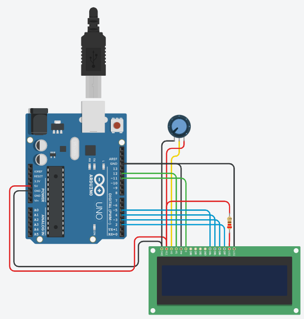

# LCD Display Module

**Liquid Crystal Displays** or LCDs have been used in electronics equipment since the late 1970s.   LCD displays have the advantage of consuming very little current.

LCD displays do not emit light. Instead they block the passage of light, like little windows which open and shut the let light through. The liquid crystals used inside LCD displays are sandwiched between two layers of polarized material. By changing the orientation of the liquid crystals they allow light to pass or they block the light entirely.


## Wiring Diagram

Because the LCD module uses a parallel data input it requires 8 connections to the host microcontroller for the data alone. Add that to the other control pins and it consumes a lot of connections.  On an Arduino Uno half of the I/O pins would be taken up by the display, which can be problematic if you want to use the I/O pins for other input or output devices.

One way of reducing the number of connections required is to use **4-wire mode**, and most projects that make use of this display do exactly that.

In 4-wire mode the data is sent a half a byte at a time, thus requiring only 4 data connections. The upper half of the data input (D4 to D7) is used while the other pins are not connected to anything.




## Source Code

```C
#include <LiquidCrystal.h>

const int rs = 12, en = 11, d4 = 5, d5 = 4, d6 = 3, d7 = 2;
LiquidCrystal lcd(rs, en, d4, d5, d6, d7);

void setup() 
{
  // set up the LCD's number of columns and rows:
  lcd.begin(16, 2);
  // Print a message to the LCD.
  lcd.print("hello, world!");
}

void loop() 
{
  // set the cursor to column 0, line 1
  // (note: line 1 is the second row, since counting begins with 0):
  lcd.setCursor(0, 1);
  // print the number of seconds since reset:
  lcd.print(millis() / 1000);
}
```


## Simulation

**Tinkercad**: [Arduino: LCD](https://www.tinkercad.com/things/8h7D4nFDaNc) 


## Library Operations

The library based on `LiquidCrystal.h` allows an Arduino board to control Liquid Crystal Displays (LCDs) based on the **Hitachi HD44780** chipset, which is found on most text-based LCDs. The library works with in either **4- or 8-bit mode**.

* **LiquidCrystal(rs, enable, d4, d5, d6, d7)**\
  **LiquidCrystal(rs, rw, enable, d4, d5, d6, d7)**\
  **LiquidCrystal(rs, enable, d0, d1, d2, d3, d4, d5, d6, d7)**\
  **LiquidCrystal(rs, rw, enable, d0, d1, d2, d3, d4, d5, d6, d7)**\
  Creates a variable of type LiquidCrystal. The display can be controlled using 4 or 8 data lines.
  * `rs`: The number of the Arduino pin that is connected to the RS pin on the LCD
  * `rw`: The number of the Arduino pin that is connected to the RW pin on the LCD (optional)
  * `enable`: The number of the Arduino pin that is connected to the enable pin on the LCD
  * `d0`, `d1`, `d2`, `d3`, `d4`, `d5`, `d6`, `d7`: The numbers of the Arduino pins that are connected to the corresponding data pins on the LCD.
    `d0`, `d1`, `d2`, and `d3` are optional; if omitted, the LCD will be controlled using only the four data lines (`d4`, `d5`, `d6`, `d7`).
  
* **void begin(uint8_t cols, uint8_t rows)**\
  Initializes the interface to the LCD screen, and specifies the dimensions (width and height) of the display. 
  `begin()` needs to be called before any other LCD library commands.
  * `cols`: The number of columns that the display has
  * `rows`: The number of rows that the display has  
  
* **void clear()**\
  Clears the LCD screen and positions the cursor in the upper-left corner.

* **void home()**\
  Positions the cursor in the upper-left of the LCD. That is, use that location in outputting subsequent text to the display. To also clear the display, use the `clear()` function instead.
  
* **size_t Serial.print(T value)**\
  **size_t print(T value, int BASE)**\  
  Prints data as text to the LCD. `print()` will return the number of bytes written.
  * `data`: the data to print (`char`, `byte`, `int`, `long`, or `string`)
  * `BASE` (optional): the base in which to print numbers: `BIN` for binary (base 2), `DEC` for decimal (base 10), 
    `OCT` for octal (base 8), `HEX` for hexadecimal (base 16).
    
* **void noDisplay()**\
 Turns off the LCD display, without losing the text currently shown on it.
 
* **void display()**\
  Turns on the LCD display, after it’s been turned off with `noDisplay()`. This will restore the text (and cursor) that was on the display.
  
* **void noBlink()**\
  
* **void blink()**\
  
  
* **void noCursor()**\

* **void cursor()**\
  
  
## References

* [YouTube (DroneBot Workshop): Using LCD Displays with Arduino](https://youtu.be/wEbGhYjn4QI)
* [DroneBot Workshop: Using LCD Displays with Arduino](https://dronebotworkshop.com/lcd-displays-arduino/)

* [Liquid Crystal Displays (LCD) with Arduino](https://docs.arduino.cc/learn/electronics/lcd-displays)

* [Arduino Reference: LiquidCrystal](https://www.arduino.cc/reference/en/libraries/liquidcrystal/)
* [GitHub: LiquidCrystal Library for Arduino](https://github.com/arduino-libraries/LiquidCrystal)

*Egon Teiniker, 2020 - 2023, GPL v3.0*
