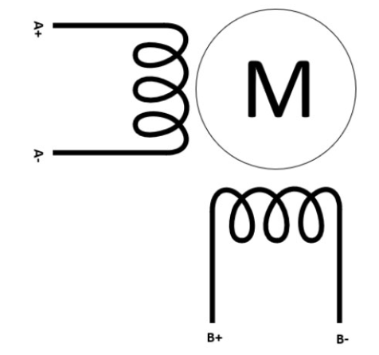
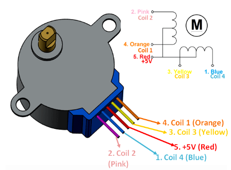

# Stepper Motors

**Stepper motors** are DC motors that rotate in precise increments or steps. 
Unlike DC motors stepper motors are controlled by applying pulses of DC electricity to their internal coils. Each pulse advances the motor by one step.

A **servo motor** is unique in that it’s motor shaft can be moved to a precise angle, most servos only **rotate 180 or 270 degrees**.
A servo motor is **aware of its position** and can be moved to a specific angle even if an external force moves the motor shaft.

**Steppers are unaware of their position**.  They can be moved to an exact position in reference to where they start stepping but unlike servos they can be misaligned if their shaft is moved by an external force.  
In many applications a servo is first moved to a **homing or reference position** before being controlled, printers commonly do this when they are first initialized.

Another advantage stepper motors have over DC motors is the ability to move at very slow speeds without stalling.
They also pack a lot of torque into a comparably small package.

## Bipolar Stepper Motors
Bipolar stepper motors consist of two coils of wire (electrically, actually split into several physical coils) and generally have four connections, two per coil.  

An advantage of bipolar stepper motors is that they make use of the entire coil winding so they are more efficient.  However, they require a more complex controller or driver to operate as **to reverse direction the polarity of the voltage applied to the coils needs to be reversed** (H-Bridge).

## Unipolar Stepper Motors
A unipolar stepper motor also consists of two coils (electrically) but each coil has a center tap so there are three connections on each coil.  This results in six connections, however many unipolar stepper motors have only five connections as the two center taps are internally connected.

In a unipolar stepper motor only half of each coil is used at one time. In most configurations, a positive voltage is applied to the center tap and left there. A negative voltage is then applied to one side of the coil to attract the motor shaft.

Now to reverse the direction of a unipolar motor you don’t need to reverse polarity. Instead, the negative voltage is applied to the OTHER side of the coil. This causes the current to flow in the opposite direction within the coil and this, in turn, moves the motor shaft in the opposite direction.

**Unipolar stepper motors are easier to control** as there is no requirement to reverse current polarity to change direction. However, as the unipolar stepper motor only makes use of half of the coil windings at any given moment they are not as efficient as half of the wiring is essentially wasted.

## Examples

* [Stepper Motor 28BYJ-48 (unipolar)](stepper-28BYJ-48)

## Library Operations 

The build-in library behind `Stepper.h` is used to control the 28BYJ-48 stepper motor.
The stepper library takes care of sequencing the pulses we will be sending to our stepper motor and it can be used with a wide variety of motors, both **unipolar and bipolar**.

* **Stepper(int steps, int in1, int in3, int in2, int in4)**\
    The Constructor is used to initialize a new Stepper object, setting the 
    pins connected to the stepper motor module ULN2003 `In1`, `In2`, `In3`, `In4`.

    `steps` is the number of steps in one revolution of your motor. 
     
    `in1` to `in4` are the pins attached to the motor module.

* **void setSpeed(long rpms)**\
    This function sets the motor speed in rotations per minute (RPMs). This function doesn’t make the motor turn, just sets the speed at which it will when you call `step()`.

* **void step(int number_of_steps)**\
    This function turns the motor a specific number of steps, at a speed determined by the most recent call to `setSpeed()`. This function is **blocking** - it will wait until the motor has finished moving to pass control to the next line in your sketch. 

## References

* [YouTube (DroneBot Workshop): Stepper Motors with Arduino - Controlling Bipolar & Unipolar stepper motors](https://youtu.be/0qwrnUeSpYQ)

* [DroneBot Workshop: Stepper Motors with Arduino – Getting Started with Stepper Motors](https://dronebotworkshop.com/stepper-motors-with-arduino/)

* [GitHub: arduino-libraries/Stepper](https://github.com/arduino-libraries/Stepper)

*Egon Teiniker, 2020 - 2023, GPL v3.0*
