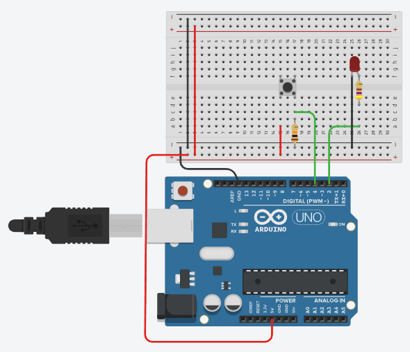

# Button Debouncing

Pushbuttons often generate spurious **open/close transitions** when pressed, 
due to mechanical and physical issues: these transitions may be 
**read as multiple presses in a very short time** fooling the program. 


## Wiring Diagram 

The connections are: Button-signal which can be connected to any digital pin on our Arduino.




## Source Code

We have to install the [**Debounce library**](https://github.com/teiniker/teiniker-lectures-arduino/tree/main/libraries/Debounce) 
to use the `Debounce.h` header file.

The library implements a class called `Debounce` that we can instantiate. 
The constructor takes the digital Arduino pin `BUTTON_PIN` which is used for the button-signal.
The default delay is of 50ms.

```C
#include <Debounce.h>

const int BUTTON_PIN = 4;
const int LED_PIN = 2;

Debounce Button(BUTTON_PIN, 50, false);

void setup() 
{
    Serial.begin(9600);  
  
    pinMode(BUTTON_PIN, INPUT);
    pinMode(LED_PIN, OUTPUT);
}

void loop() 
{
   // Read the button state and write it to the LED.
   byte status = Button.read();
   digitalWrite(LED_PIN, status); 

   // Read the button count and write it to the Serial interface.
   unsigned int count = Button.count();
   Serial.println(count);       
}
```
Using the method `read()` we get a stable status of the button. This status will be 
displayed via the connected LED.

The `count()` returns the number of changes ocurred to the button. We send that number 
to the `Serial` monitor.

## Library Operations

* **Debounce(byte button, unsigned long delay = 50, boolean pullup = true)**\
    Constructor creates a `Debounce` object for our button, with a default delay of 50ms.
    Also per default, the internal pullup resistor will be used (`INPUT_PULLUP`). 

* **byte read()**\
    Reads our button state and returns `HIGH` or `LOW` after debouncing it. 
    It should always return `HIGH` when the button is pressed, and `LOW` otherwise.

* **unsigned int count()**\
    Returns the counter of changes ocurred to the button. 
    The counter will increase by 1 each time you press the button for longer than the debounce time. 

* **void resetCount()**\
    Resets the counter for the button changes.


## References
* [Debouncing a Button with Arduino](https://www.programmingelectronics.com/debouncing-a-button-with-arduino/)
* [Debounce on a Pushbutton](https://docs.arduino.cc/built-in-examples/digital/Debounce)
* [GitHub: Debounce](https://github.com/wkoch/Debounce)

*Egon Teiniker, 2020 - 2022, GPL v3.0* 
