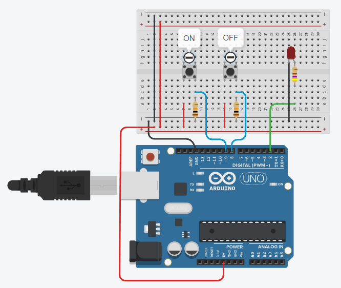

# State Machine: LED

Given a simple circuit with which an LED can be switched on and off using two buttons.



The functionality is defined by a **UML State Machine Diagram**. 


_Simulation (Tinkercad):_ [Arduino: LED State Machine](https://www.tinkercad.com/things/47lGqM81tf0)

The implementation takes place on the Arduino board in C and begins with the definition of the 
possible **events** and **states** as enums,  the state machine function prototype, and the 
possible **activities** encapsulated into functions.

```C
// Events 
enum events
{
    SWITCH_ON,
    SWITCH_OFF
};
enum events event = SWITCH_OFF;

// State Machine States
enum sm_states 
{
    OFF,
    ON
};

enum sm_states state; 
void sm_led(enum events event);
void sm_led_off(enum events event);
void sm_led_on(enum events event);

// Activities
int led_status = LOW;
void led_on();
void led_off();
```

The state machine evaluates the **current state** to invoke the right event handler.

```C
void sm_led(enum events event)
{
    switch(state)
    {
        case OFF:
            sm_led_off(event);
            break;

        case ON:
            sm_led_on(event);
            break;
    }
}
```

For every state, a seperate event handler function has been implemented to handle
each event in the right way.

```C
// Handle Events in State: OFF
void sm_led_off(enum events event)
{
    switch(event)
    {
        case SWITCH_ON:
            led_on();
            state = ON;
        break;

        case SWITCH_OFF:
        break;
    }
}
```

```C
// Handle Events in State: ON
void sm_led_on(enum events event)
{
    switch(event)
    {
        case SWITCH_ON:
        break;

        case SWITCH_OFF:
            led_off();
            state = OFF;
        break;
    }
}
```

For simple state machines, we can often see that both the evaluation of the states and the event handler 
are implemented in a nested switch-case statement.
However, this implementation pattern is confusing and difficult to extend.

*Egon Teiniker, 2020 - 2022, GPL v3.0* 